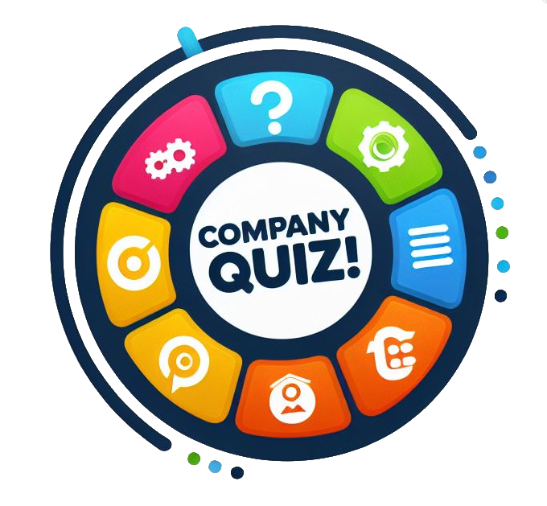

<br/>
<p align="center">
  <a href="https://github.com/ej8899/companyQuiz">
    
  </a>

  <h1 align="center">CompanyQuiz!</h1>

  <p align="center">
    Test your Employees on their knowledge of company policy and received detailed and summary reports!
    <br/>
    <br/>
    <a href="https://github.com/ej8899/companyQuiz"><strong>Explore the docs »</strong></a>
    <br/>
    <br/>
    <a href="https://github.com/ej8899/companyQuiz">View Demo</a>
    .
    <a href="https://github.com/ej8899/companyQuiz/issues">Report Bug</a>
    .
    <a href="https://github.com/ej8899/companyQuiz/issues">Request Feature</a>
  </p>
</p>

    


## Table Of Contents

* [About the Project](#about-the-project)
* [Built With](#built-with)
* [Getting Started](#getting-started)
  * [Prerequisites](#prerequisites)
  * [Installation](#installation)
* [Usage](#usage)
* [Roadmap](#roadmap)
* [Contributing](#contributing)
* [License](#license)
* [Authors](#authors)
* [Acknowledgements](#acknowledgements)

## About The Project


(coming soon)

CompanyQuiz! is intended to allow your company to deploy simple quizzes and exams to your staff to test their knowledge on various company policy and proeedures.

A simple end user interface allows your staff to select the policy or area of testing.

A more robust backend allows administrators to review all users quiz results and status, create new quizzes, and add new users for testing.

## Built With

Built with React, MySQL and PHP.

## Getting Started

-- coming soon --

### Prerequisites

-- coming soon --

### Installation

1. Get a free API Key at [https://example.com](https://example.com)

2. Clone the repo

```sh
git clone https://github.com/your_username_/Project-Name.git
```

3. Install NPM packages

```sh
npm install
```

4. Enter your API in `config.js`

```JS
const API_KEY = 'ENTER YOUR API';
```

## Usage

-- coming soon --

_For more examples, please refer to the [Documentation](https://example.com)_

## Roadmap

See the [open issues](https://github.com/ej8899/companyQuiz/issues) for a list of proposed features (and known issues).

## Contributing

Contributions are what make the open source community such an amazing place to be learn, inspire, and create. Any contributions you make are **greatly appreciated**.
* If you have suggestions for adding or removing projects, feel free to [open an issue](https://github.com/ej8899/companyQuiz/issues/new) to discuss it, or directly create a pull request after you edit the *README.md* file with necessary changes.
* Please make sure you check your spelling and grammar.
* Create individual PR for each suggestion.
* Please also read through the [Code Of Conduct](https://github.com/ej8899/companyQuiz/blob/main/CODE_OF_CONDUCT.md) before posting your first idea as well.

### Creating A Pull Request

1. Fork the Project
2. Create your Feature Branch (`git checkout -b feature/AmazingFeature`)
3. Commit your Changes (`git commit -m 'Add some AmazingFeature'`)
4. Push to the Branch (`git push origin feature/AmazingFeature`)
5. Open a Pull Request

## License

Distributed under the MIT License. See [LICENSE](https://github.com/ej8899/companyQuiz/blob/main/LICENSE.md) for more information.

## Authors

* **[Ernie Johnson](https://erniejohnson.ca)** - *Applicaton Developer & Project Manager*

## Acknowledgements

* [Shields IO badges (on readme)](https://shields.io/badges)